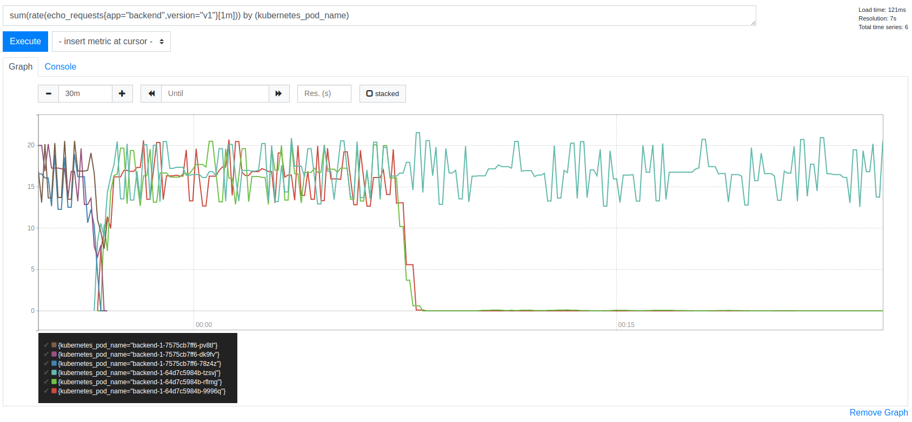
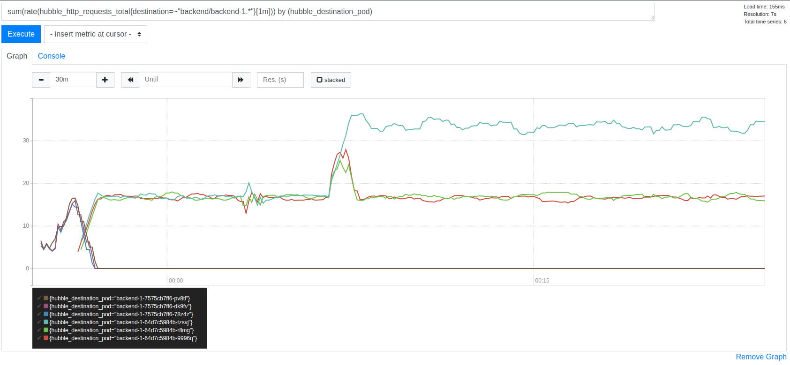
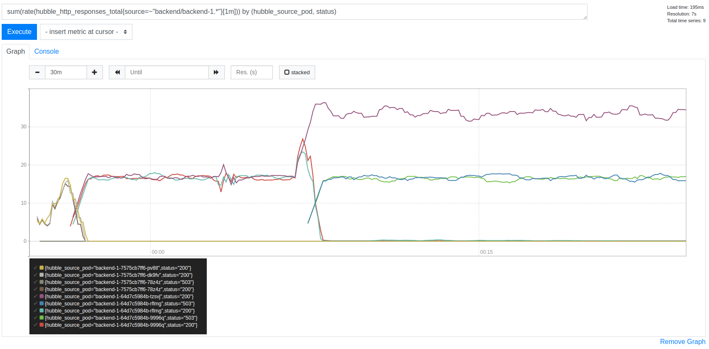

cilium-debugging
==========================

A repo to aid in reproducing a load balancing issue.

Requires `docker`, `kind` and `helm` to run locally.

Tested with Cilium version `v1.9.0` on Ubuntu 20.10:

```shell
$ uname -a
Linux nickt 5.8.0-31-generic #33-Ubuntu SMP Mon Nov 23 18:44:54 UTC 2020 x86_64 x86_64 x86_64 GNU/Linux
```

## Reproducer

Builds and spins up a three Pod Deployment of a simple HTTP server and a single
Pod deployment of a load generator.

Create a 4 node cluster with Cilium as the CNI:

```bash
$ make create-with-cilium BACKEND_CNI_ENABLED=true
```

The load test issues requests on fresh connections to the backend so as to try
and avoid sticky TCP sessions. Load is generated at a rate of 50 requests per
second. The expected load on a single Pod should therefore be around 16-17
requests / per second.

Load is initially be evenly distributed across all three backend Pods.

After running the load test for a few minutes to establish a baseline, create
the CNP in the `load-test` namespace:

```bash
$ make install-load-test LOADTEST_CNI_ENABLED=true
```

Observe the following:

1. The number of requests received by the backends is now unevenly distributed:



2. The number of requests reported by Hubble is elevated for one Pod:



3. There is an elevated rate of 5xx responses. Digging into this, it appears
   that one Pod is returning the 200s and the other two are returning the 5xxs:



The Pod returning the 200 responses (`backend-1-64d7c5984b-tzsvj`) is on the
same node as the Pod running the load-test (`cluster-worker-3`):

```bash
$ kubectl -n backend get pods -o wide -l version=v1
NAME                         READY   STATUS    RESTARTS   AGE   IP            NODE              NOMINATED NODE   READINESS GATES
backend-1-64d7c5984b-9996q   1/1     Running   0          33m   10.244.2.68   cluster-worker2   <none>           <none>
backend-1-64d7c5984b-rflmg   1/1     Running   0          33m   10.244.1.99   cluster-worker    <none>           <none>
backend-1-64d7c5984b-tzsvj   1/1     Running   0          33m   10.244.3.41   cluster-worker3   <none>           <none>

$ kubectl -n load-test get pods -o wide -l app=load-test-1
NAME                           READY   STATUS    RESTARTS   AGE   IP             NODE              NOMINATED NODE   READINESS GATES
load-test-1-6c857b5c9d-4vvbf   1/1     Running   0          26m   10.244.3.144   cluster-worker3   <none>           <none>
```
