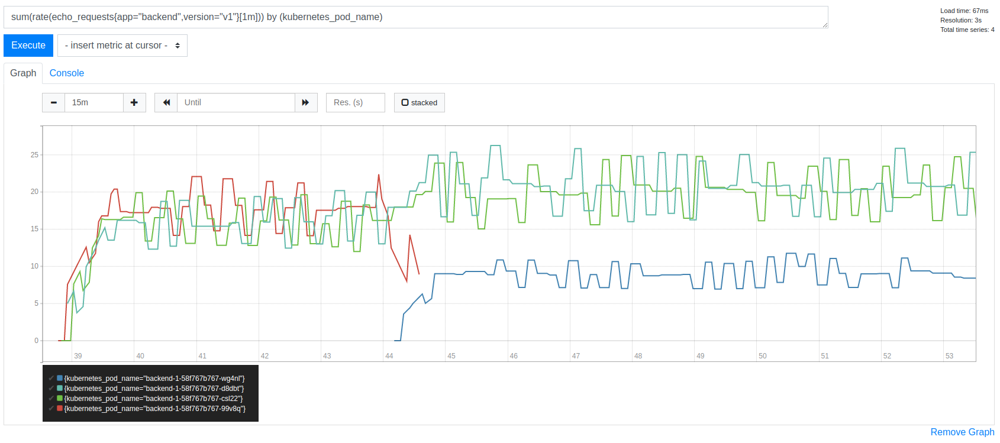
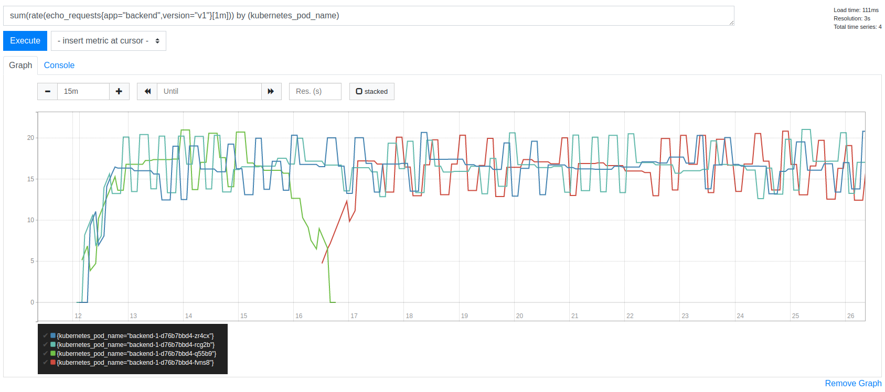

cilium-debugging
==========================

A repo to aid in reproducing a load balancing issue.

Requires `docker`, `kind` and `helm` to run locally.

Tested with Cilium version `v1.9.0` on Ubuntu 20.10:

```shell
$ uname -a
Linux nickt 5.8.0-29-generic #31-Ubuntu SMP Fri Nov 6 12:37:59 UTC 2020 x86_64 x86_64 x86_64 GNU/Linux
```

## Reproducer: with Cilium

Builds and spins up a three Pod Deployment of a simple HTTP server and a single
Pod deployment of a load generator.

Run `make create-with-cilium` to create a 4 node cluster with Cilium as the
CNI.

The load test issues requests on fresh connections to the backend so as to try
and avoid sticky TCP sessions. Load is generated at a rate of 50 requests per
second. The expected load on a single Pod should therefore be around 16-17
requests / per second.

Port forward to the Prometheus instance in the cluster:

```shell
$ make port-forward-prometheus
```

The following metric is a count of requests handled by the backend process and
is a good indication of traffic distributed to each Pod:

```
sum(rate(echo_requests{app="backend",version="v1"}[1m])) by (kubernetes_pod_name)
```

Load should initially be evenly distributed across all three backend Pods.

After a few minutes, delete a single backend pod, so that a new pod is created
in its place. The load should now look unevenly distributed. The two older Pods
should be receiving more load than the new Pod:



In the above, we expect all three lines to continue to trend around the same
value after the new Pod has been created.

## Without Cilium

The same Deployment of a backend and load generator, but in a cluster _without_
Cilium as the CNI. Instead this just uses the default CNI that ships with Kind.

Run `make create-without-cilium` to set up the cluster without Cilium.

Performing as above, deleting a single Pod should result in load continuing to
be evenly distributed among all three Pods.


